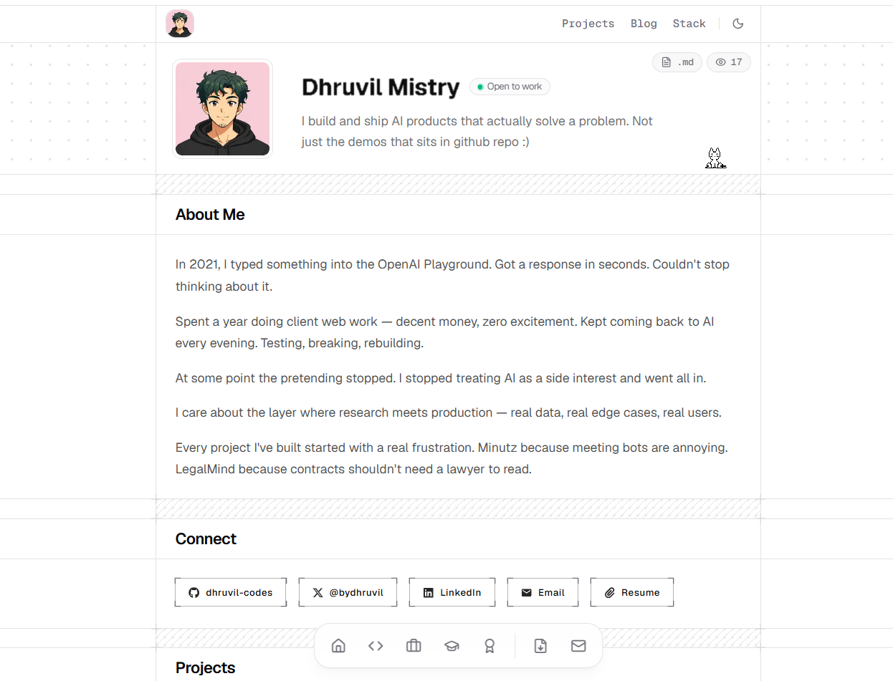

<div align="center">


# bydhruvil.in

**Personal portfolio of Dhruvil Mistry — AI Engineer**

*Building production-grade LLM systems, RAG pipelines & full-stack AI products*

[](https://www.bydhruvil.in)
[](https://nextjs.org)
[](https://www.typescriptlang.org)
[](https://vercel.com)

</div>

---

## ✨ Features

| Feature | Description |
|---|---|
| 🎨 **Dark / Light Mode** | System preference detection with smooth transitions |
| 🤖 **AI Chat Assistant** | Ask "Donna" anything about Dhruvil — powered by Groq LLaMA |
| 🔊 **Voice Responses** | AI replies with realistic text-to-speech via Fish Audio |
| 👁️ **Live Visitor Counter** | Persistent real-time visit tracking via Upstash Redis |
| 🐱 **Miko the Cat** | An interactive oneko-style cat that follows your cursor |
| 📄 **Resume Download** | One-click PDF download from the floating dock |
| 📝 **Blog** | Long-form writing pulled from Medium |
| 📚 **Stack / Curated Reads** | Handpicked Substack articles that shaped Dhruvil's thinking |
| 🎊 **Confetti** | Click the visitor counter for a surprise |
| 📱 **Fully Responsive** | Pixel-perfect across desktop and mobile |

---

## 🛠 Tech Stack

```
Framework     →  Next.js 16 (App Router)
Language      →  TypeScript 5
Styling       →  Tailwind CSS v4
Components    →  shadcn/ui, Radix UI, MagicUI
Animation     →  Framer Motion, Motion
AI / LLM      →  Groq (LLaMA 3)
TTS           →  Fish Audio
Database      →  Upstash Redis (visitor counter)
Deployment    →  Vercel
Domain        →  Hostinger → bydhruvil.in
```

---

## 📸 Preview

> Homepage — Hero, About Me, Connect, Projects



---

## 🗂 Project Structure

```
app/
├── page.tsx              # Homepage
├── layout.tsx            # Root layout + metadata
├── globals.css           # Design tokens + Tailwind
├── blog/                 # Blog listing page
├── projects/             # Projects showcase
├── stack/                # Curated reads (Substacks)
└── api/
    ├── visitors/         # Visitor counter (Upstash Redis)
    └── chat/             # AI chat endpoint (Groq)

components/
├── sections/             # Page sections (header, navbar, footer, etc.)
├── stack/                # Stack card components
└── ui/                   # Reusable primitives (dock, morphing text, etc.)

data/
└── visitors.json         # Local dev fallback for visitor count

public/
├── images/               # Profile photos, project banners
├── resume.pdf            # Downloadable resume
└── sounds/               # UI sound effects
```

---

## 🚀 Running Locally

```bash
# Clone the repo
git clone https://github.com/dhruvil-codes/bydhruvil.git
cd bydhruvil

# Install dependencies
npm install

# Set up environment variables
cp .env.example .env.local
# Fill in: GROQ_API_KEY, FISH_AUDIO_API_KEY, FISH_AUDIO_VOICE_ID

# Start the dev server
npm run dev
```

Open [http://localhost:3000](http://localhost:3000)

---

## 🔑 Environment Variables

| Variable | Description |
|---|---|
| `GROQ_API_KEY` | Groq API key for the AI chat assistant |
| `FISH_AUDIO_API_KEY` | Fish Audio key for TTS voice responses |
| `FISH_AUDIO_VOICE_ID` | Voice ID for TTS |
| `UPSTASH_REDIS_REST_URL` *(prod)* | Upstash Redis URL for visitor counter |
| `UPSTASH_REDIS_REST_TOKEN` *(prod)* | Upstash Redis token |

---

## 📄 Pages

| Route | Description |
|---|---|
| `/` | Homepage — hero, about, skills, experience, education, certifications |
| `/projects` | Project showcase — Minutz, Clarity, LegalMind, Skin Cure |
| `/blog` | Long-form writing |
| `/stack` | Curated Substack reads |

---

## 🤝 Connect

<div align="center">

[](https://linkedin.com/in/dhruvilmistry16)
[](https://x.com/bydhruvil)
[](https://github.com/dhruvil-codes)
[](https://bydhruvil.medium.com)

</div>

---

<div align="center">

Built with ❤️ by [Dhruvil Mistry](https://www.bydhruvil.in) · MIT License

</div>
